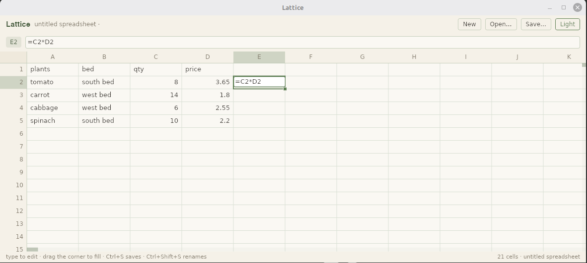
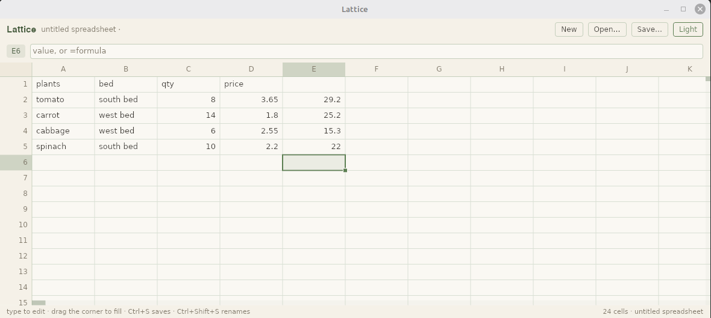

# Lattice

A spreadsheet with a real recalculation engine and a desktop UI built in Rust with iced.


*A sample sheet in Lattice, with a formula cell selected.*

## Why

Most spreadsheets recalculate more than they need to, and homemade ones slow down once the sheet gets big. Two goals drive this one instead:

- editing one cell should only recompute what actually depends on it, even in a sheet with 100,000+ rows
- the grid should scroll smoothly no matter how big the sheet is, since it only draws what's visible on screen

Both hold up in practice: editing a cell in a 100,000 row sheet takes about 1.2ms and recomputes exactly 2 cells, no matter where you edit.

## How it works

- `engine/` is the actual spreadsheet logic: cell storage, the formula language, the recalculation engine. No UI code at all, fully testable on its own.
- `examples/spreadsheet/` is the iced desktop app that displays it.

Formulas parse into an AST, compile to flat bytecode, and run on a stack machine instead of walking a tree each time. Cells are stored sparsely, so an empty one costs nothing.

The trick behind the speed: a formula reading a range like `A1:A1000` doesn't create a thousand individual dependencies, it just watches the range. That's what keeps edits fast on huge sheets, instead of every edit rewriting a pile of dependency edges.

Circular references get caught and marked as errors instead of freezing or crashing.

Here's what filling a formula down looks like. This uses its own small table, separate from the sample above, just for the screenshots:

| | A | B | C | D | E |
|---|---|---|---|---|---|
| 1 | plants | bed | qty | price | |
| 2 | tomato | south bed | 8 | 3.65 | |
| 3 | carrot | west bed | 14 | 1.80 | |
| 4 | cabbage | west bed | 6 | 2.55 | |
| 5 | spinach | south bed | 10 | 2.20 | |

Put `=C2*D2` in E2 (qty times price, a row total) and hit enter, then drag that cell's fill handle down through E3, E4, and E5.





## Functions and syntax it supports

Arithmetic: `+  -  *  /  ^` with normal precedence, parentheses, and unary minus (`-2^2` is `4`, same as Excel). Comparisons: `=  <>  <  <=  >  >=`.

References: `A1` for a cell, `A1:B10` for a rectangular range, `$A$1` for an anchor that doesn't move when copied or filled.

The original aggregates are still there: `SUM`, `AVERAGE`, `COUNT`, `MIN`, `MAX`, `CONCAT`, plus the branch-compiled `IF`, `IFS`, `IFERROR` and `IFNA`. Ranges handed to an aggregate contribute their numbers only, text, booleans and blanks *inside* a range are ignored, while a scalar argument coerces (`SUM(TRUE, 2)` is `3`) and a text scalar is a `#VALUE!`.

The examples below all use this little table (`A1:D4`), which you can type in as-is. Column A is the `region`, column B the `fruit`, column C the `qty` on hand and column D the unit `price`:

```lattice-sample
A1 region
B1 fruit
C1 qty
D1 price
A2 north
B2 apple
C2 10
D2 1.25
A3 south
B3 banana
C3 20
D3 0.75
A4 north
B4 cherry
C4 30
D4 2.50
```

### Logic

`AND(value...)`: true only when every argument is true; a range's text and blanks are ignored, but a text scalar is `#VALUE!`.

`=AND(TRUE, 1, 2)` → `TRUE`: a nonzero number counts as true alongside a real boolean.

`=AND(1, 0)` → `FALSE`: one false argument makes the whole call false.

`OR(value...)`: false only when every argument is false.

`=OR(FALSE, 0, 2)` → `TRUE`: one true argument is enough.

`=OR(0, 0)` → `FALSE`: nothing true anywhere.

`NOT(value)`: negates a single value that can be read as a truth value.

`=NOT(0)` → `TRUE`: zero is false, so its negation is true.

`=NOT(TRUE)` → `FALSE`

`XOR(value...)`: true when an odd number of the arguments are true.

`=XOR(TRUE, TRUE)` → `FALSE`: two trues cancel out.

`=XOR(TRUE, TRUE, TRUE)` → `TRUE`: an odd count of trues is true.

### Math

**Text is never a number by accident.** No arithmetic function parses numeric text, so every number argument has to be a number:

`=ROUND("2.5", 0)` → `#VALUE!`: text as a number argument is a type error, exactly like `="2.5"+0`; `VALUE("2.5")` is the explicit door.

`ROUND(number, [digits])`: rounds half away from zero on the digits a user sees; a negative digit count rounds to tens and hundreds.

`=ROUND(2.675, 2)` → `2.68`: rounding works on the decimal digits, not on a binary scaling that would answer `2.67`.

`=ROUND(1234, -2)` → `1200`: a negative digit count rounds to the nearest hundred.

`ROUNDUP(number, [digits])`: always rounds away from zero.

`=ROUNDUP(2.1, 0)` → `3`

`=ROUNDUP(-2.1, 0)` → `-3`: away from zero means more negative for a negative number.

`ROUNDDOWN(number, [digits])`: always rounds toward zero.

`=ROUNDDOWN(2.9, 0)` → `2`

`=ROUNDDOWN(-2.9, 0)` → `-2`

`ABS(number)`: the magnitude of a number, without its sign.

`=ABS(-3)` → `3`

`=ABS(-2.5)` → `2.5`

`SQRT(number)`: the non-negative square root; a negative argument is `#NUM!`.

`=SQRT(9)` → `3`

`=SQRT(-1)` → `#NUM!`: there is no real square root to give.

`POWER(number, power)`: the same as the `^` operator, with overflow or a non-real result reported as `#NUM!`.

`=POWER(2, 10)` → `1024`

`=POWER(-8, 0.5)` → `#NUM!`: the result is not a real number.

`MOD(number, divisor)`: the remainder, taking the sign of the divisor.

`=MOD(-3, 2)` → `1`: the result follows the sign of `2`, not of `-3`.

`=MOD(3, -2)` → `-1`

`INT(number)`: floors toward negative infinity.

`=INT(2.9)` → `2`

`=INT(-1.5)` → `-2`: down, not toward zero.

`TRUNC(number, [digits])`: truncates toward zero, like `ROUNDDOWN`.

`=TRUNC(2.9)` → `2`

`=TRUNC(-1.5)` → `-1`: the visible difference from `INT`, which answers `-2`.

`CEILING(number, [significance])`: rounds toward positive infinity to a multiple of the significance; this follows `CEILING.MATH`, so a mixed sign never gives `#NUM!`.

`=CEILING(2.5, 1)` → `3`

`=CEILING(-2.5, 1)` → `-2`

`FLOOR(number, [significance])`: rounds toward negative infinity to a multiple of the significance, following `FLOOR.MATH`.

`=FLOOR(2.5, 1)` → `2`

`=FLOOR(-2.5, 1)` → `-3`

`SIGN(number)`: `-1`, `0` or `1` according to the sign.

`=SIGN(-4)` → `-1`

`=SIGN(0)` → `0`

### Text

`LEN(text)`: the number of characters, never bytes.

`=LEN("héllo")` → `5`: the accented character counts once.

`=LEN("")` → `0`

`UPPER(text)`: upper-cases text.

`=UPPER("abc")` → `ABC`

`LOWER(text)`: lower-cases text.

`=LOWER("HÉLLO")` → `héllo`

`TRIM(text)`: strips the leading and trailing spaces and collapses internal runs of spaces to one; a tab is not a space and survives.

`=TRIM("  a   b  ")` → `a b`

`=TRIM("  hello  world  ")` → `hello world`: the ends go and each gap shrinks to one space.

`LEFT(text, [count])`: the leftmost characters; the count defaults to 1.

`=LEFT("abc", 2)` → `ab`

`=LEFT("abc", 10)` → `abc`: asking for more characters than there are returns everything.

`RIGHT(text, [count])`: the rightmost characters.

`=RIGHT("abc", 2)` → `bc`

`=RIGHT("abc")` → `c`: the count defaults to 1.

`MID(text, start, count)`: characters from a 1-based start.

`=MID("abc", 2, 2)` → `bc`

`=MID("héllo", 2, 1)` → `é`: positions count characters, so the accent is one character.

`FIND(needle, text, [start])`: the 1-based position of the needle, case-sensitively and without wildcards; not finding it is `#VALUE!`.

`=FIND("b", "abc")` → `2`

`=FIND("A", "abc")` → `#VALUE!`: case matters, so the upper-case `A` is not found.

`SEARCH(needle, text, [start])`: like `FIND`, but case-insensitive and wildcard-aware.

`=SEARCH("B", "abc")` → `2`: case is folded.

`=SEARCH("b*", "abc")` → `2`: `*` matches any run of characters.

`SUBSTITUTE(text, old, new, [instance])`: replaces every occurrence of `old`, or only the given one.

`=SUBSTITUTE("a-b-c", "-", "+")` → `a+b+c`

`=SUBSTITUTE("a-b-c", "-", "+", 2)` → `a-b+c`: only the second match changes.

`REPLACE(text, start, count, new)`: swaps a character range for new text.

`=REPLACE("abcdef", 2, 3, "X")` → `aXef`

`=REPLACE("abc", 1, 0, "X")` → `Xabc`: a zero length inserts.

`TEXT(number, format)`: renders a number through a small number-format subset: `0`/`#` digits, `,` grouping, `.`, `%` and quoted literals.

`=TEXT(1234.5, "#,##0.00")` → `1,234.50`

`=TEXT(0.125, "0.0%")` → `12.5%`

`VALUE(text)`: the explicit door from text to a number; it parses numbers only, so a date like `"1/2/2020"` is `#VALUE!` rather than a serial.

`=VALUE("$1,234.50")` → `1234.5`: a leading currency symbol and correctly placed thousands separators are accepted.

`=VALUE("abc")` → `#VALUE!`: anything that is not a number is an error, not a zero.

### Lookup

Every lookup needs a rectangle; a scalar where a table is expected is `#VALUE!`, not a silent one-cell range. `XLOOKUP` is the one to reach for by default, since a separate lookup range and return range leave no column index to miscount.

`VLOOKUP(value, range, col_index, [approximate])`: searches the first column of the range and returns a cell from the found row.

`=VLOOKUP(20, C2:D4, 2, FALSE)` → `0.75`: exact matching on the qty column returns that row's price.

`=VLOOKUP(15, C2:D4, 2)` → `1.25`: the fourth argument defaults to approximate matching, so a qty of 15 that is not in the table quietly returns the 10 row.

`HLOOKUP(value, range, row_index, [approximate])`: searches the first row and returns a cell from the found column.

`=HLOOKUP("qty", A1:D4, 3, FALSE)` → `20`: the third row below the `qty` header.

`=HLOOKUP("qty", A1:D4, 3)` → `#N/A`: the default approximate match assumes a sorted first row, and `region` already sorts after `qty`.

`INDEX(range, row, [column])`: the value at a 1-based offset inside the range.

`=INDEX(A2:D4, 2, 3)` → `20`: row 2, column 3 of the range is `C3`.

`=INDEX(C2:C4, 2)` → `20`: a single-column range takes the one index as the row.

`=INDEX(A2:D4, 2)` → `#VALUE!`: a rectangle with no column index would have to be a whole row, and there are no arrays.

`MATCH(value, range, [match_type])`: the 1-based position within the range; `0` is exact, `1` (the default) the largest value not greater, `-1` the smallest value not less.

`=MATCH(20, C2:C4, 0)` → `2`

`=MATCH(35, C2:C4)` → `3`: the default approximate mode returns the last qty at or below 35.

`XLOOKUP(value, lookup_range, return_range, [if_not_found])`: matches two ranges position by position; exact and case-insensitive, with no index to get wrong.

`=XLOOKUP("banana", B2:B4, C2:C4)` → `20`

`=XLOOKUP("durian", B2:B4, C2:C4, "not found")` → `not found`: the fourth argument stands in for `#N/A`.

`=XLOOKUP("durian", B2:B4, C2:C4)` → `#N/A`

### Conditional Aggregation

All six functions speak the same criterion language: a number, a boolean, or text with an optional leading `>=`, `<=`, `<>`, `>`, `<` or `=`. A criterion has a domain, so `">10"` matches numbers only and never text, while `"10"` (a text spelling of a number) matches both the number `10` and the text `10`. Wildcards (`*`, `?`, `~`) apply to text equality.

`SUMIF(criteria_range, criterion, [sum_range])`: adds the numbers whose criteria_range cell matches; without a sum_range it adds the criteria_range itself.

`=SUMIF(A2:A4, "north", C2:C4)` → `40`: the two northern rows have 10 and 30.

`=SUMIF(C2:C4, ">15")` → `50`: the criteria range is summed when there is no sum range.

`COUNTIF(criteria_range, criterion)`: counts the stored cells that match.

`=COUNTIF(A2:A4, "north")` → `2`

`=COUNTIF(C2:C4, ">15")` → `2`

`=COUNTIF(A1:A9, "")` → `0`: the range walk visits stored cells only, so there is no blank cell to count.

`AVERAGEIF(criteria_range, criterion, [average_range])`: the mean of the matching numbers, `#DIV/0!` when nothing matches.

`=AVERAGEIF(A2:A4, "north", D2:D4)` → `1.875`: the mean of 1.25 and 2.50.

`=AVERAGEIF(A2:A4, "east", C2:C4)` → `#DIV/0!`: no row matches.

`SUMIFS(sum_range, criteria_range1, criterion1, ...)`: adds sum_range where every range/criterion pair matches.

`=SUMIFS(C2:C4, A2:A4, "north", B2:B4, "cherry")` → `30`: only the cherry row is both.

`=SUMIFS(D2:D4, C2:C4, ">15")` → `3.25`: the prices of the 20 and 30 rows.

`COUNTIFS(criteria_range1, criterion1, ...)`: counts the positions where every pair matches.

`=COUNTIFS(A2:A4, "north", C2:C4, ">15")` → `1`

`=COUNTIFS(A2:A4, "north")` → `2`

`AVERAGEIFS(average_range, criteria_range1, criterion1, ...)`: the mean of average_range where every pair matches, `#DIV/0!` when nothing does.

`=AVERAGEIFS(C2:C4, A2:A4, "north")` → `20`: the mean of 10 and 30.

### Statistics

These read their arguments exactly like `SUM`/`AVERAGE`: a range contributes its numbers only, a scalar coerces, and a text scalar is `#VALUE!`. `STDEV` and `VAR` are the **sample** statistics, dividing by `n - 1`. An aggregate with nothing to work on is `#DIV/0!`, this engine's convention rather than Excel's mix of `#NUM!` and `#DIV/0!`.

`MEDIAN(number...)`: the middle value, or the mean of the two middle values.

`=MEDIAN(1, 2, 3, 4)` → `2.5`

`=MEDIAN(C2:C4)` → `20`: the sample sheet holds 10, 20 and 30.

`MODE(number...)`: the most frequent value; ties go to the smallest, and `#N/A` when nothing repeats.

`=MODE(1, 2, 2, 3)` → `2`

`=MODE(1, 2, 3)` → `#N/A`: no value repeats, so there is no mode.

`STDEV(number...)`: the sample standard deviation.

`=STDEV(2, 4, 6)` → `2`

`=STDEV(3)` → `#DIV/0!`: one observation leaves nothing to divide by.

`VAR(number...)`: the sample variance.

`=VAR(1, 2, 3, 4, 5)` → `2.5`

`=VAR(2, 4, 6)` → `4`

### Date/Time

**A date is a serial number: the count of whole days since 1899-12-30**, with the time of day as the fractional part. Serial `0` is 1899-12-30, `45292` is 2024-01-01 and `2958465` is 9999-12-31, the largest supported serial. This matches Excel for every date from 1900-03-01 onwards; Excel also counts a `1900-02-29` that never existed, and Lattice does not, so January and February 1900 are one serial lower than Excel's. A serial that is negative, past 9999-12-31, or not a number is `#NUM!`. `TODAY()` and `NOW()` are **volatile**: they read the system clock, they're UTC since the engine carries no time-zone data, and every recalculation, any edit anywhere, refreshes every cell that calls one, so there's no ticking timer and no stale cell.

`TODAY()`: the serial for today, in UTC, refreshed by every recalculation.

`=ISNUMBER(TODAY())` → `TRUE`: the result is an ordinary date serial.

`NOW()`: today's serial plus the fraction of the day already elapsed.

`=ISNUMBER(NOW())` → `TRUE`

`=NOW()-TODAY()<1` → `TRUE`: the time of day is the fraction of a day.

`DATE(year, month, day)`: builds the serial for a date; months and days outside their range carry, so no normalising arithmetic is ever needed.

`=DATE(2024, 1, 1)` → `45292`

`=DATE(2024, 13, 1)` → `45658`: month 13 becomes January of the next year.

`=DATE(2024, 2, 30)` → `45352`: February 30 becomes March 1.

`YEAR(serial)`: the year of a date serial.

`=YEAR(45292)` → `2024`

`=YEAR(0)` → `1899`: serial 0 is the epoch, 1899-12-30.

`MONTH(serial)`: the month of a date serial.

`=MONTH(45292)` → `1`

`=MONTH(61)` → `3`

`DAY(serial)`: the day of the month of a date serial.

`=DAY(45292)` → `1`

`=DAY(0)` → `30`

`WEEKDAY(serial, [return_type])`: the day of the week; type 1 (the default) numbers Sunday 1, type 2 Monday 1, type 3 Monday 0.

`=WEEKDAY(45292)` → `2`: 2024-01-01 was a Monday.

`=WEEKDAY(45292, 2)` → `1`

`=WEEKDAY(45292, 3)` → `0`

`DATEDIF(start, end, unit)`: the difference between two serials in `Y`, `M`, `D`, `YM`, `MD` or `YD` units; `start` after `end` is `#NUM!`.

`=DATEDIF(DATE(2024, 1, 1), DATE(2024, 3, 15), "D")` → `74`

`=DATEDIF(DATE(2020, 3, 15), DATE(2024, 3, 14), "Y")` → `3`: one day short of the fourth anniversary.

`=DATEDIF(DATE(2024, 1, 15), DATE(2024, 3, 14), "MD")` → `28`: the days left after whole months.

### Type Checking

The `IS*` predicates look *at* an error argument instead of returning it, so `ISERROR(#N/A)` is `TRUE` rather than `#N/A`.

`ISBLANK(value)`: true only for an unused cell; there is no such thing as a cell that exists but is blank.

`=ISBLANK(A5)` → `TRUE`: `A5` sits outside the sample table and was never written.

`=ISBLANK("")` → `FALSE`: an empty string is text, not a blank cell.

`ISNUMBER(value)`: true for a number.

`=ISNUMBER(45292)` → `TRUE`

`=ISNUMBER("45292")` → `FALSE`: text that spells a number is still text.

`ISTEXT(value)`: true for text.

`=ISTEXT(A2)` → `TRUE`: `A2` holds `north`.

`=ISTEXT(1)` → `FALSE`

`ISERROR(value)`: true for any error value.

`=ISERROR(#N/A)` → `TRUE`

`=ISERROR(1)` → `FALSE`

`ISNA(value)`: true only for `#N/A`.

`=ISNA(#N/A)` → `TRUE`

`=ISNA(#DIV/0!)` → `FALSE`: a different error is not `#N/A`.

### Not implemented yet

Not in the language yet: `PMT`, `FV`, `PV`, `NPV`, `RATE`, `INDIRECT`, `OFFSET`, `CHOOSE`, `REPT`, `TEXTJOIN`, `PERCENTILE`, `RANK`, `CORREL`, `EDATE`, `EOMONTH`, `NETWORKDAYS`, `WORKDAY`, and the dynamic-array group `UNIQUE`/`SORT`/`FILTER`/`SEQUENCE`, which needs array spilling in the evaluator.

All function names are case-insensitive. Errors are typed values, not crashes: `#DIV/0!`, `#REF!`, `#VALUE!`, `#NAME?`, `#NUM!`, `#N/A`, `#CYCLE!`, `#PARSE!`, and they flow through a formula the same way a number does.

## What it supports

- fill handle, drag to select, formula bar, keyboard navigation
- light and dark themes, following your OS setting or overridden by hand
- saving and loading workbooks as JSON

## What it doesn't support yet

- multiple sheets in one workbook
- cell formatting, borders, column widths
- undo/redo
- `.xlsx` import or export
- a native file picker (you name your workbook instead of browsing for a file)

These are all things I plan to add. Contributions welcome.

## Build

Needs Rust **1.90+** for the workspace. That floor comes from the UI side: `iced` needs 1.88, its `wgpu` backend needs 1.90 through `ordered-float`. `engine` has no UI dependencies and builds on **1.88** alone.

```sh
cargo test --workspace     # run the test suite
cargo run --release -p app # run the app
```

If you're on NixOS, use `./run.sh` instead. iced and wgpu need some system libraries that NixOS keeps out of the normal search path, and the script sets that up for you.

## Project layout

```
engine/   the spreadsheet engine, no UI dependencies
examples/spreadsheet/  the iced desktop app
  state.rs        what is selected, edited and in view; the read-only accessors
  input.rs        keyboard and pointer handling, and the update loop
  persistence.rs  saving, loading, and the naming prompt
  settings.rs     the app's own preferences, and the file that remembers them
  application.rs  the widget tree
  grid.rs         the virtualised canvas
  theme.rs        the light and dark "garden lattice" palettes
run.sh    NixOS launcher script
```

## License

[MIT](LICENSE-MIT). Use it, fork it, build on it, just keep the license notice.

## Contributing

Start with [CONTRIBUTING.md](CONTRIBUTING.md). Short version: `engine` never depends on iced or any UI code, a change to the recalculation core needs a test that proves the work it does, not just the time, and the checked-in proptest regression seeds don't get deleted.

More docs on the internals (the dependency graph, the formula compiler, etc) are coming. If you want to dig in before that, `engine/` is fully covered by tests, so it's a reasonably safe place to poke around.
